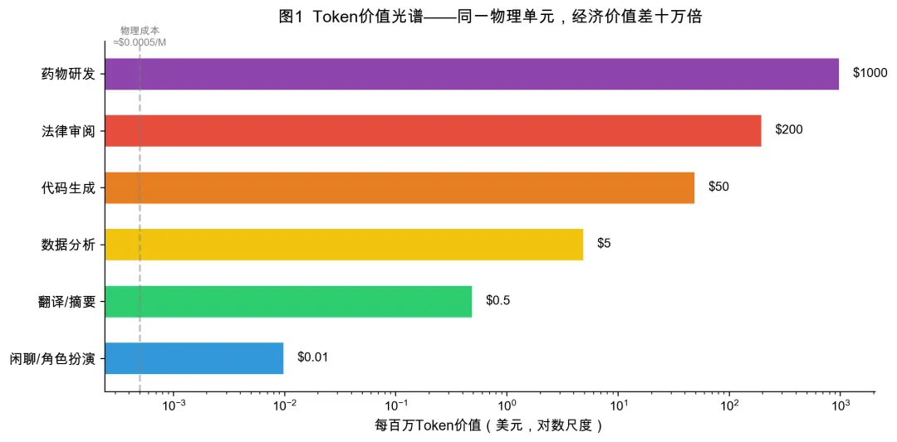

一个还不太成熟的想法：**AI 应用的第一性原理，或许是输出有业务价值的 Token**。

比如 Claude Code，输出的 Token 是高质量代码，能够直接替代程序员的人力成本，这是业务价值；

OpenClaw 输出的 Token 是能够直接操作计算机，执行工作的 CLI 命令，从而减少人工工作成本，这同样具备业务价值。

而如果放在 AI 游戏里，这个 Token 可能是高精度的 3D 建模（类似[Hunyuan 3D](https://3d.hunyuan.tencent.com/)），也可能是有趣好玩的文本内容（AI 文字冒险游戏）。

[*Sora 输出的 Token 是视频（🪦R.I.P）*](https://x.com/soraofficialapp/status/2036546752535470382)

但它们的共同点，都在于：**Token 本身具备可兑现的价值**。

<figure>
  
  <figcaption style="text-align: center;">图源：腾讯研究院-Token经济学七问</figcaption>
</figure>

从这个角度看，NVIDIA 提出的「AI 工厂」概念，其实也是在抽象 AI 应用的本质——  
**输入电力与数据，输出 Token**；

而阿里最近新增的事业群「Alibaba Token Hub」，某种程度上也像是在推动行业对 AI 应用价值的共识。

> NVIDIA 不只是单纯的 GPU 芯片公司，更像在建造一种新型基础设施：AI 工厂。  
> **原料是电力和数据，产出是 Token**。
> 
> —— [Jensen Huang: NVIDIA - The $4 Trillion Company & the AI Revolution | Lex Fridman Podcast](https://www.youtube.com/watch?v=vif8NQcjVf0)