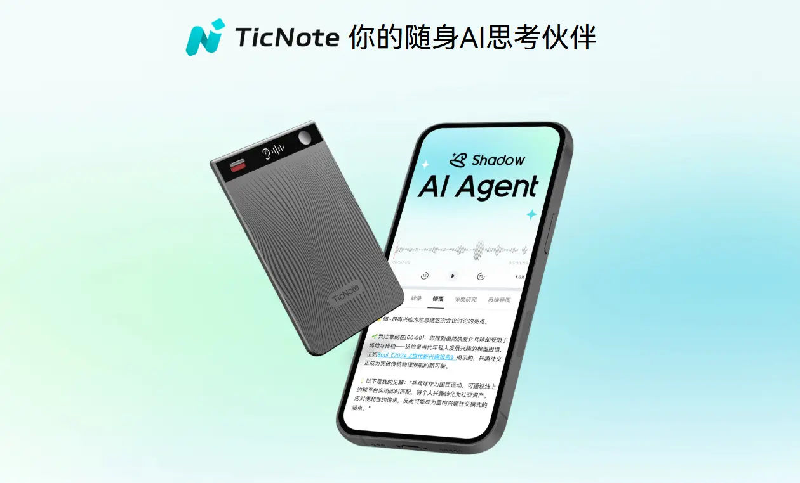
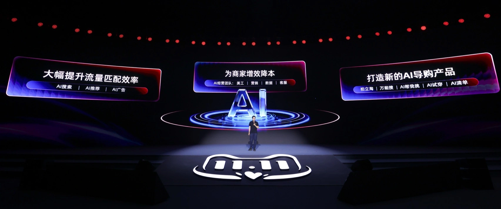
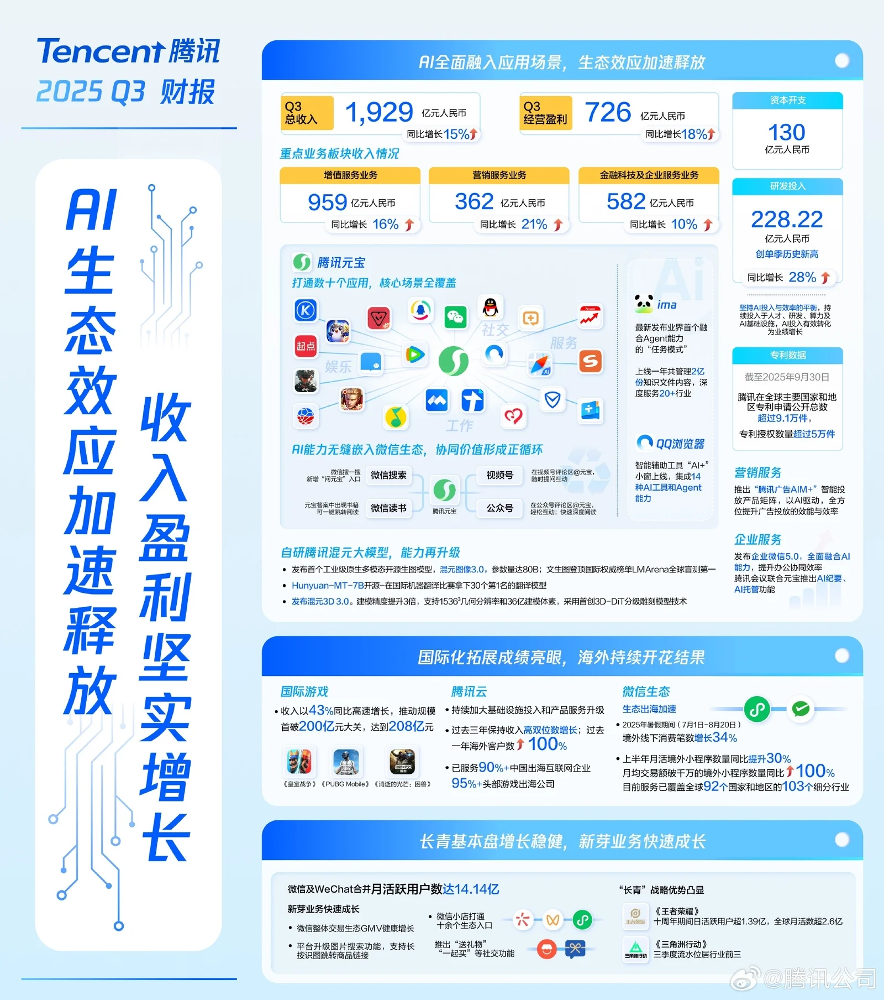
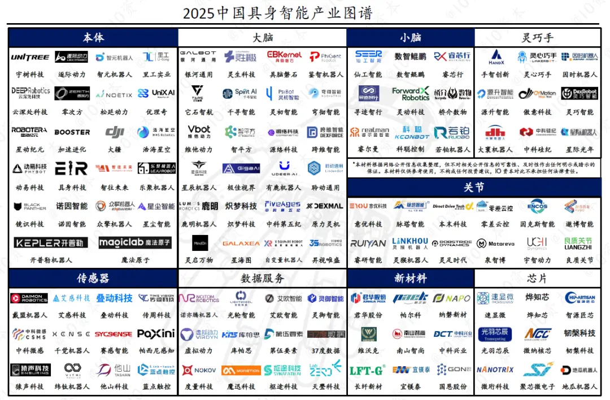

我目前认为，在国内做 AI 创新，更可能落地的方向大致有四类：

## 1. AI 硬件创新：做 AI 领域的大疆

相较于软件，硬件在商业模式上天然更容易变现（直接售卖产品），再结合以深圳为代表的中国完整工业制造体系，以及大疆、影石等硬件领域的先行者作为参照，这条路经蕴含着巨大的机会空间。

## 2. 成熟业务模式 + AI：电商 + AI、游戏 + AI 等

这对国内绝大多数的公司而言，是最稳定的 AI 落地范式，也是我目前在实际工作中接触最多的路径：**不改变原有商业模式，AI 主要用于降本增效、提升转化和留存**。ROI 可计算，组织也更愿意为此买单。

但这种方式往往带来的只是“增量改良”，创新很容易被 KPI 吸收，最终沉淀为工具或能力组件，而非真正意义上的新产品。

## 3. 成熟互联网生态 + AI：头部互联网平台产生业务增量

在腾讯、字节、阿里等成熟互联网生态中，由于其本身已具备显著的规模化能力——有流量、有场景、有数据、有分发——因此 AI 更容易实现规模化落地。

但关键并不在于“是否引入 AI”，而在于：**能否将 AI 转变为用户习惯性的流量入口**；否则，它也可能只是短期热度，难以转化为实质性的业务价值。这也是近期字节布局手机端系统级 Agent、以及阿里高度重视并推进 C 端产品「千问」 APP 的原因之一。

## 4. 具身智能供应链：在产业链中寻找可落地的机会

尽管人形机器人的研发与制造门槛极高，真正具备全面下场能力的玩家有限，但顺着产业现实，切入具身智能的供应链环节，仍然存在可行空间，例如零部件、模组、系统集成、渠道与交付等。

在国家层面的具身智能战略与完整工业制造体系的基础之上，**通过供应链与工程能力获取产业红利**，而非依赖技术叙事去赌终局，本身也是一条具备现实可行性的路径。

## 延伸阅读

- [《创新是一场充满激情的远行，却未必是明智的商业选择》]()