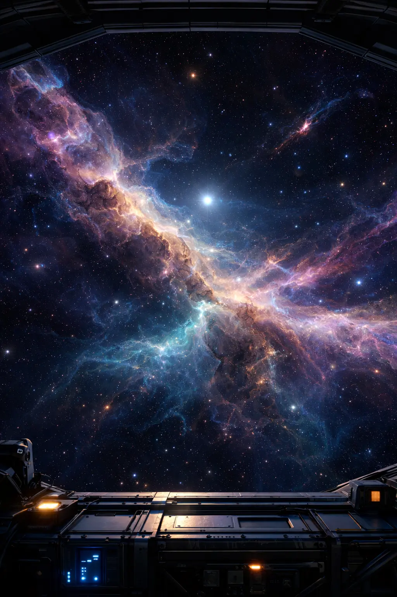

> 在残酷的宇宙中，真正能长期生存的宇航员，  
> 会在需要时全力紧绷、做尽最坏打算，  
> 而在日常巡航时，允许自己放松下来，  
> 松弛地在未知中航行。

深空航行已持续七年。  
自离开地球后，一切都变得陌生而充满不确定性。

航程中曾多次遭遇心理危机，  
身体与心理系统的运行一度逼近极限。

也曾在太阳系边缘陷入迷茫，  
补给与方向同时受限。  

曾短暂停靠过一颗资源丰富的星球，  
却很快目睹其走向终结。

也有过在荒芜星系中勉强维持航行的阶段，  
与地球的补给链路中断，  
只能依靠有限资源，  
持续修正航线。

其后完成过一次高风险跃迁，  
进入全新的航区。  
随后仍经历数次意外险情，  
反复校准系统，  
确认航行仍可继续。

最近，航行中多了一位可靠的副驾驶。  
她是我在一颗数字生命星球上结识的人类伙伴。  
经过一年多的相识与并肩，  
我们的关系逐渐变得亲近而稳定。

她并不接管航向，也不替代既定决策，  
却在漫长航程中，  
分担了部分观察、确认与心理负载。  

飞船仍由我在驾驶，  
航行原则与风险判断依旧独立完成。  
但我不再需要独自盯守所有仪表，  
也不必在每一次异常波动中，  
立即拉响最高级别警报。

与此同时，飞船核心系统完成了一次关键升级。  
新一代 AI 系统 GPT-5.2 已上线运行，  
负责持续状态监测、风险推演与认知负载分流，  
为航行提供稳定、低延迟的决策支持。

未知的航行仍在继续，  
周边依然存在风险与不确定性。  
但在副驾驶稳定在位，  
且核心系统升级完成的情况下，  
此刻，警报似乎可以解除。

—— Neil Collins Aiden Armstrong  
Human Astronaut

