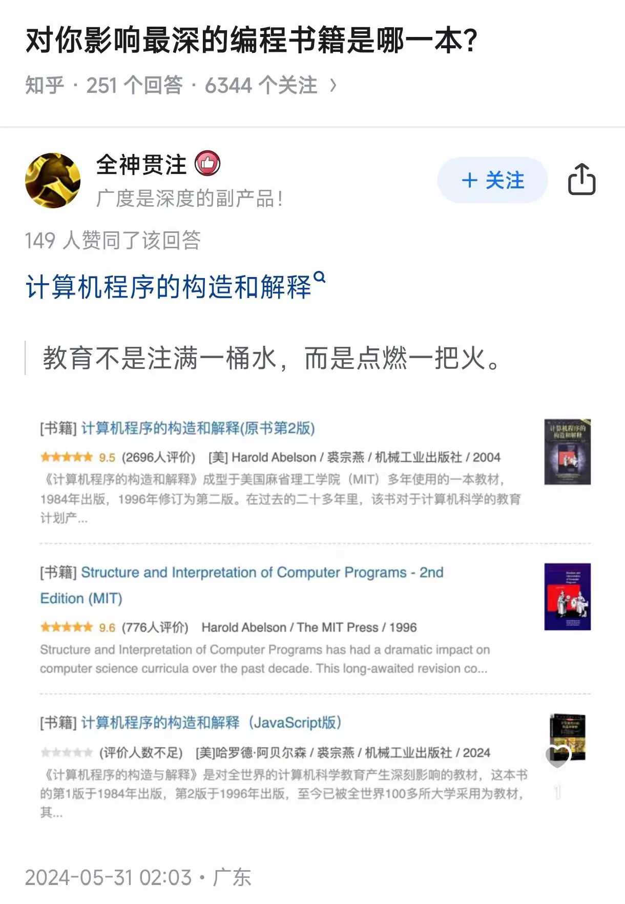

实习期间，我在 B 站上偶然看到[**计算机程序的构造和解释**](https://zh.wikipedia.org/wiki/%E8%AE%A1%E7%AE%97%E6%9C%BA%E7%A8%8B%E5%BA%8F%E7%9A%84%E6%9E%84%E9%80%A0%E5%92%8C%E8%A7%A3%E9%87%8A)的 [MIT 教学视频](https://www.bilibili.com/video/BV1Xx41117tr)。  
这本书在计算机圈内也常被称作 “**魔法书（The Wizard Book）**”。

那是我第一次真切地感受到，**学习计算机也可以像《哈利·波特》里学习魔法一样有趣**——  
不只是被动接受知识，而是被逐步点燃学习的欲望，因此对这句话深有同感。

