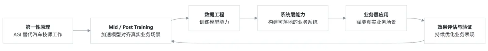

*本文更多是一种思考过程的记录，而非已经被完整验证的结论。*

## 背景

结合之前在微博上看到的智谱 AI 首席科学家唐杰的分享[「谈 2025 年对大模型的看法」](#llm-in-2025)，  
我尝试从第一性原理出发，推演如果从零开始做一款车主 Chatbot，在业务落地层面可能要经过哪些关键路径。

  <small>从第一性原理出发，对车主 Chatbot 实现路径的推演</small>

## 一、第一性原理

> **目标：用 AGI 替代 汽车技师 的部分工作，解答车主的日常问题咨询。**

如果这个目标成立，那么后续所有设计，都应该围绕“专业判断能力是否形成”展开，而不是围绕用户画像、问题类型或业务流程本身。

## 二、让模型对齐真实业务场景，增强实际体感

> **Mid 和 Post Training 使得模型更快对齐业务场景，并具备更强的推理能力成为可能。**

换句话说，就是让模型更快学会在真实业务场景下应该如何思考，如何回答。

### 1. 继续预训练 Continued Pre-Training（CPT）
- 补齐领域知识，包括系统原理、故障机理与因果关系

### 2. 模型微调 Supervised Fine-Tuning（SFT）
- 对齐专业表达方式与推理结构
- 让模型在“怎么说、怎么想”上更接近专业人员

### 3. 强化学习训练 Preference Optimization（DPO / RLHF）
- 压制高风险、误导性或不负责任的回答
- 鼓励生成高质量回答

### 4. 知识蒸馏 Distillation
- 将大参数模型的能力蒸馏到更小、更稳定的模型
- 便于线上部署与高并发场景
- 同时控制整体模型成本

## 三、数据工程

> 无论采用哪种训练路径，**数据** 始终是绕不开的前提。

### 1. 文档知识源
- 维修手册
- 车主手册
- 技术通告
- 其他结构化或半结构化专业资料

这些数据的主要作用，是为模型提供可靠的事实锚点，而非单纯扩充知识覆盖面。

### 2. 真实车主问答数据
- 用于**对齐**真实车主的提问方式
- 覆盖情绪、噪声、表达不完整等真实场景
- 弥补“工程知识”与“用户语言”之间的鸿沟

## 四、系统层能力

> 即便模型能力得到增强，系统层的约束与协同仍然不可或缺。

### 1. System Prompt
- 约束角色身份（不是“万能助手”）
- 明确职责边界与安全红线
- 统一整体的思考与输出风格

### 2. RAG（Retrieval-Augmented Generation）
- 为模型提供可追溯、可更新的外部知识来源
- 在推理阶段补充事实依据，降低幻觉风险
- 作为模型能力之外的重要兜底机制，而非替代模型判断本身

### 3. Agent
- 针对不同类型的问题，生成相应的思考流程
- 将“专业人员的思考流程”拆解为可执行步骤
- 协调模型、RAG 与工具调用之间的顺序与边界

### 4. Tools & MCP
- 补充模型不可知或不可靠的信息，例如配置查询、外部检索、结构化计算
- 承接必要的外部业务调用能力

## 五、效果评估与验证

以上更多是对工程实现路径的推演，并不意味着效果一定成立。  

这些判断是否可靠，仍需要在后续实践中通过评估与反馈不断修正，例如：

- bad case 分析
- Benchmark 的建立与持续评估
- GPT-as-a-judge 等自动化评测方式

## 备注

这些思考目前大多还停留在纸面上。

但它或许指向了一条更接近大模型本质的实现路径。
