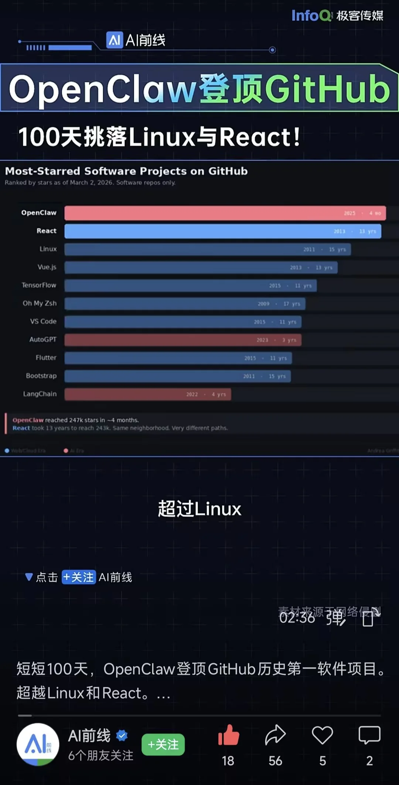

---
title: "OpenClaw 登顶 GitHub"
date: 2026-03-06T18:00:00+08:00
draft: false
tags: ["随记", "AI", "OpenClaw"]
---

OpenClaw 登顶 GitHub，超越 Linux 和 React。

如果说 ChatGPT 让人第一次意识到，AI 可以像人一样对话；  
那么 OpenClaw 这类项目，正在让更多的人进一步意识到，**AI 不只会说话，它还可以直接完成工作。**

**它让人们开始认真相信，Agent 不只是玩具，而可能成为下一个时代的主角。**
