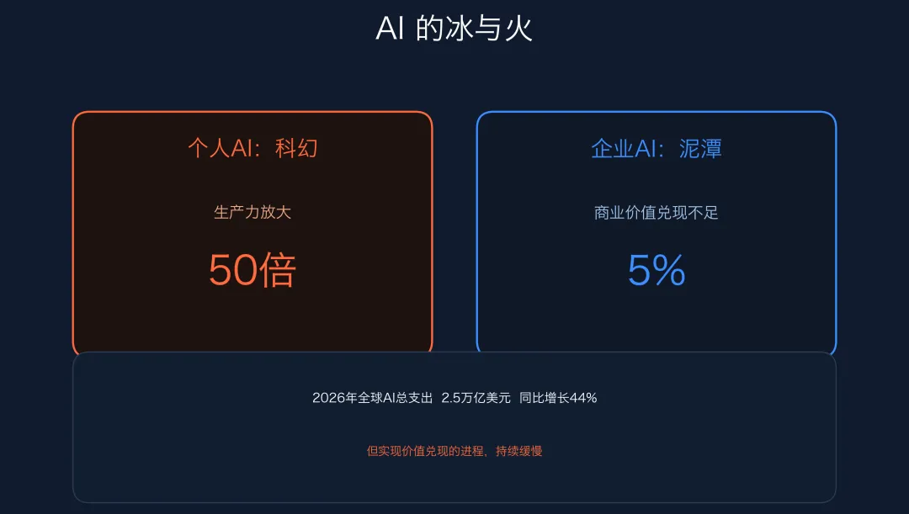
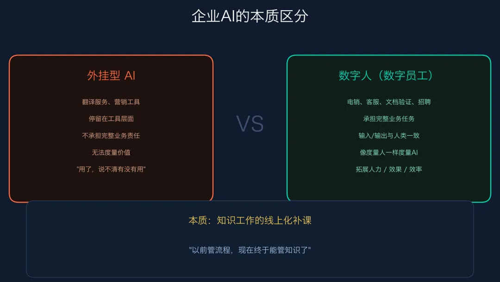

最近读到一篇对我启发特别大的文章，是阿里云的[《AI 大模型时代的 CIO | 企业智变下的 CIO 集体之问》](https://www.infoq.cn/article/jUUq67MUlQYq0146lADD)，里面**非常客观现实地**剖析了如今 AI 在企业真实业务落地中面临的困境，以及潜在的共识与解法。

## 一边科幻，一边泥潭

首先，开篇的发问就让人振聋发聩：

> 漫天的 AI 应用，让**个人的生产力可以扩张 50 倍**。
>
> 而据 MIT 针对 2025 年商业人工智能现状的研究显示，全球 54% 的顶级企业将 AI 列为优先投资，但**真正实现转型价值的，还不足 5%**。
>
> 即使到今年，这一局面并未出现明显改善。
> 
> 据普华永道今年 1 月发布的数据显示，仅有约 **12%** 的 CEO 认为企业 AI 已经实现成本与收入两端的价值兑现。

为什么会出现这样一种强烈的反差？

作为个人，以我作为具体的案例，我是非常愿意每月付 20 美元开通 ChatGPT Plus 会员的，它也的确每天都在为我的工作产生实实在在的生产力提升——直接生成PRD、直接编码实现原型、清洗并分析数据等等，这些的确相比起没有 AI 的时代，让我的个人生产力实现了巨大的提升，而相比之下，每月不到 200 块钱的成本反而是非常可以接受的。

对于广大的工程师，使用 Claude Code 以及各个模型厂商提供的 Coding Plan 来进行研发提效，也是非常划算、非常愿意付费的一件事。

就连最普通的小白用户，OpenClaw 🦞 的出现也让大家开始对 AI 感到兴奋，并愿意为 AI 买单。

**而企业呢**？

一旦企业想要在真实业务中落地 AI ，接踵而来的不一定是收益提升，但一定有成本上的新增：
- 数据建设成本
- 系统开发成本
- 模型调用成本
- 调优成本
- 评测成本
- 兜底机制成本
- 上线后的事故成本
- ...

**而 AI 对企业业务产生的实际收益是什么呢？几乎看不太清**。

一件只能看到投入，难以看到产出，并且产出天然还带着一种“不确定性”的时候，任何企业即便想探索做 AI 落地，也都面临着巨大的风险和潜在亏损。

## AI 对企业的业务价值在哪里？

开门见山地说：**让 AI 成为数字员工，从而用更少的钱，替换真人，完成一些企业最基础的工作**。

这也是 OpenClaw 之前让许多企业老板，以及个体户感到兴奋的原因之一：

> 你是说，我每个月只需要花几十几百块钱，就能养一个 7x24 小时在线，并且任劳任怨，不会有任何负面情绪，十分听我话的 AI 打工虾🦞？那我可得尝试尝试。

## 可这一切真的能如愿实现吗？
