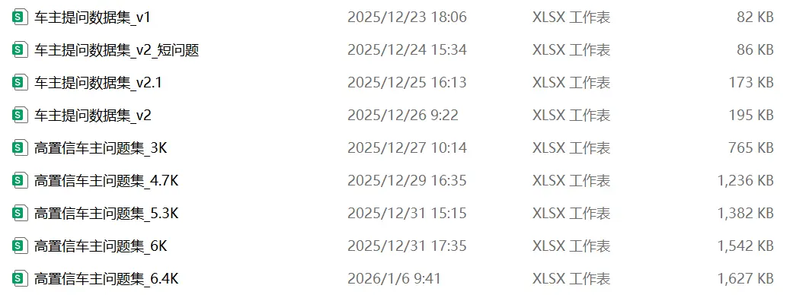

这篇文章记录的是：我在为一款 **垂直应用 Chatbot** 准备数据的过程中，经过一系列实践尝试，逐渐沉淀下来的一套数据工作流思路。

它并不新颖，也并不复杂，但在真实的业务环境中，非常管用。

如果从产品视角来看，这里的大多数问题，都已经落在我所定义的 [AI 工程化层](#ai-engineering-layer)。

---

## 适合谁阅读（请先看这里）

在继续往下之前，我想先明确一点：这篇文章**并不适合所有人**。

**它可能不太适合：**
- 算法研究员
- AI 竞赛玩家
- 以模型结构与训练技巧为主要关注点的 ML 工程师

**它更适合：**
- AI 产品经理
- 应用型 AI 工程师
- 在团队里「被迫开始做数据」的人
- 想把 AI 真正跑起来，而不仅仅停留在 Demo 阶段的人

如果你期待的是更复杂的模型、更新颖的算法，这篇文章大概率会让你失望；  
但如果你关心的是，**在现实约束下，数据如何一步步从无到有，从充满噪声到变得可用**，那它或许能给你提供一些参考。

---

## 任务背景：做一款面向车主的 Chatbot

最初的目标，是做一款**面向普通车主的问答型 Chatbot**，用于解答他们在真实用车场景中会遇到的各类问题。

例如：

- 「仪表盘上那个像茶壶一样的灯亮了，是怎么回事？」
- 「开车时方向盘老是抖，速度越快抖得越厉害，怎么回事？」
- 「这两天仪表盘上老显示一个保养的黄扳手，请问再多跑一两千公里去保养行吗？」

这类问题通常具有一些共性特征：

- **高度口语化**
- **上下文信息缺失**
- **专业名词与俗称混杂**
- **带有明显的情绪与不确定性**

如果希望模型的回复在语气上更贴近真实车主的表达，在判断上让人感到安全、可信，而不只是一个干巴巴的“百科式问答机器人”，那么仅靠现成的通用语料显然是不够的。

因此，我需要准备一批**来源于真实车主表达、语气自然、质量可控且规模足够大的车主问答数据**，用于后续的车主画像分析与模型微调。

---

## 第一个问题：数据从哪里来？

无论是用于后续的 LoRA 微调，还是支撑更高质量的车主画像分析与多轮对话策略设计，首先要解决的，其实都是同一个问题：

**如何规模化地收集来自真实车主表达的问答数据？**

在已有的数据资产中，并不具备这一类型的数据，因此只能从外部渠道入手，尽可能补齐这一基础。

在不依赖任何内部或私有数据的前提下，可用于分析的数据来源其实并不多，主要包括：

- 汽车社区与论坛（如汽车之家、懂车帝车友圈等）
- 内容型平台（如 B 站、抖音、小红书等）
- 公开数据集（竞赛数据集、Hugging Face 等）
- AI 生成的 dummy 数据

综合**数据质量、表达真实性与规模潜力**等因素评估后，我们最终将最高优先级放在了**内容型平台（B 站、抖音、小红书等）**。 

> **Tip**: 在不少传统公司组织中，“数据工程”这一概念并不直观，陌生概念往往会带来不必要的沟通成本。因此在实际协作中，可以将其认知降维为 **「内容工程 + AI 工程」**  
> - 从公开平台进行数据采集与清洗，可视为“AI 工程”的一部分；  
> - 而对数据的分析、结构化与业务使用，则更接近“内容工程”。

这类平台上的内容更贴近真实车主的自然表达，往往带有情绪、口语化表述与大量俗称，同时数据规模足够大、问题类型覆盖全面，既有利于后续的数据扩展与迭代，也适合用于分析不同问题类型与使用场景下的车主画像。

但关键问题在于：**这些地方的数据，噪声太大了。**

- 大量与问题无关的闲聊与互动（如点赞、调侃）
- 大量表情、情绪化符号与非文本回应
- 大量上下文缺失的碎片文本
- 甚至夹杂着广告或完全无关的信息

很快，我便意识到一件事：

> **真正的难点，并不在于“能不能抓到数据”，  
> 而在于“如何从一堆噪声中，筛选出少量真正可用的内容”。**

---

## 为什么我没有一开始就用大模型？

在这个阶段，很多人会下意识地给出一种方案：  
> 直接把原始数据丢给大模型，让大模型逐条判断“这是不是一个高质量的车主问题”。

但在早期实践中，我刻意没有这么做，原因很简单：**成本不可控**。

从公开平台获取的数据规模往往在数十万级别，而单条文本的 token 数也并不低。如果将全量数据直接交由大模型进行判断，token 消耗会迅速膨胀，整体成本在这个阶段并不友好，也缺乏可持续性。

更重要的是，在数据极脏、清洗目标尚未稳定之前，过早引入大模型，反而会放大不确定性——其输出本身就具有概率性，且在此阶段难以避免幻觉问题。

因此，在这一阶段，我更需要的是一种**稳定、可控、且成本可预期的筛选方式**，用来先建立数据处理的基本秩序。

---

## 一个非常“老”的组合：TF-IDF + Logistic Regression

在正式确定方案之前，我也曾考虑过一些看起来“更现代”的做法。

例如，使用 [SetFit](https://github.com/huggingface/setfit) 通过少量标注样本进行 few-shot 文本分类，对全量文本数据进行筛选。

但最终，在使用 ChatGPT 对不同方案进行初步梳理与对比评估之后，我选择了一套更加朴素、也更加稳妥的方法：**[TF-IDF](https://zh.wikipedia.org/wiki/Tf-idf) + [Logistic Regression](https://zh.wikipedia.org/wiki/%E9%82%8F%E8%BC%AF%E6%96%AF%E8%AB%A6%E8%BF%B4%E6%AD%B8)**。

- 使用 **[TF-IDF](https://zh.wikipedia.org/wiki/Tf-idf)** 对文本进行向量化表示  
- 使用 **[Logistic Regression](https://zh.wikipedia.org/wiki/%E9%82%8F%E8%BC%AF%E6%96%AF%E8%AB%A6%E8%BF%B4%E6%AD%B8)** 进行文本二分类  
- 目标并不是“判断是否完美”，而是**尽可能把明显无用的数据挡在外面**

这套方法的优势在于：

- **成本极低**，本地即可轻量化运行  
- **运行速度快**，适合对大规模数据进行清洗与筛选
- 对中文短文本场景**表现稳定** 

它并不聪明，但在这个阶段，**足够可靠**。

---

## 接下来要解决的，是“怎么把数据工作流跑起来”

在确定了整体的数据筛选思路之后，接下来要解决的问题，就变得非常具体了：  

**如何把这些判断，落实为一条能够稳定运行的数据工作流。**

在这一阶段，我主要做了四件事情。

### 1. 原始数据的获取：从公开平台采集评论数据

首先需要解决的，是原始数据的获取。

我们选择了使用开源工具 [MediaCrawler](https://github.com/NanmiCoder/MediaCrawler)，从多个公开平台中采集与汽车相关的评论与回复内容，作为最初的原始数据来源。

搜索关键词主要包括两类：
- **常见车型相关问题**，如：大众常见故障，奥迪常见故障，奔驰常见故障等
- **汽车系统的常见问题**，如：发动机异响、方向盘抖动、故障灯亮、空调出风口不出风等

需要说明的是，这一步获取的数据本身质量并不高，噪声极大，更接近一个**原始语料池**，而不是可直接使用的训练数据。

### 2. 用简单规则与少量样本，完成数据初筛

在原始数据极度嘈杂的情况下，我并没有试图一开始就追求精细判断。

相反，我先通过一些基础的清洗脚本，配合少量人工标注样本，构建最基础的正负例数据，用于完成第一轮筛选。

在构建正负例之前，我先对原始文本做了一次**非常轻量的规范化清洗**，目的并不是“提升语义质量”，而只是尽量消除一些明显的格式噪声，让后续的规则与模型判断更加稳定。

清洗逻辑本身也保持得很简单，主要处理空值与多余空白字符：
```python
def normalize_text(s: str) -> str:
    if s is None:
        return ""
    s = str(s)
    s = re.sub(r"\s+", " ", s).strip()
    return s

# 文本清洗
douyin["content_norm"] = douyin["content"].map(normalize_text)
```

在完成这一步基础清洗之后，再基于清洗后的文本，人工抽样构建正负例数据。

**正例数据（Positive examples）** 是通过人工抽样整理的高质量真实车主问题，例如：
- 发动机工作状态踩离合感觉有点震脚，有沙子似的
- 开空调在减速情况下熄火，请问是什么原因
- 空调制热功能，四个出风口中控两个通风口不出风，制冷时四个都出风，这种情况是否正常

**负例数据（Negative examples）** 则是从原始数据池中人工挑选的大量噪声样本，例如：
- 就冲你发的这么简单明了的步骤，必须关注你[赞][赞][赞]
- 说的一点毛病都没有！
- 这期内容干货满满，看完真的有种安心的感觉！

为了让这一步能够在数十万级别的数据规模上跑起来，我刻意把第一轮筛选做得尽量简单：**只训练一个轻量的二分类器，用来先过滤掉明显无效的内容**。

下面是初筛脚本的核心逻辑（TF-IDF + Logistic Regression）：

```python
raw_df = pd.read_excel("comment.xlsx")           # 全量原始评论（列：content_norm）
pos_df = pd.read_excel("positive_example.xlsx").assign(label=1)
neg_df = pd.read_excel("negative_example.xlsx").assign(label=0)

train_df = (
    pd.concat(
        [pos_df[["content_norm", "label"]], neg_df[["content_norm", "label"]]],
        ignore_index=True,
    )
    .dropna(subset=["content_norm"])
    .drop_duplicates(subset=["content_norm"])
)

X_train, X_val, y_train, y_val = train_test_split(
    train_df["content_norm"],
    train_df["label"],
    test_size=0.2,
    random_state=42,
    stratify=train_df["label"],
)

model = Pipeline([
    ("tfidf", TfidfVectorizer(
        analyzer="char",
        ngram_range=(2, 5),
        min_df=2,
        max_df=0.95,
    )),
    ("lr", LogisticRegression(
        max_iter=4000,
        class_weight="balanced",
    )),
])

model.fit(X_train, y_train)

raw_df = raw_df.dropna(subset=["content_norm"]).copy()
raw_df["question_prob"] = model.predict_proba(raw_df["content_norm"])[:, 1]

(
    raw_df.assign(content_clean=raw_df["content_norm"])
          .loc[
              raw_df["question_prob"] >= 0.7,
              ["content_clean", "question_prob"],
          ]
          .sort_values("question_prob", ascending=False)
          .to_excel("high_conf_car_owner_questions_p0.7.xlsx", index=False)
)
```

这一步的目标并不是得到一个高精度分类器，而是通过程序化的方式，让机器能够**在大规模数据中先过滤掉一部分明显无效的内容**，从而把后续需要人工关注的数据量控制在一个可接受的范围内。

### 3. 扩充数据上下文，让人工判断变得可行

为了支撑后续的人工精筛，仅有孤立的问题文本，往往不足以支撑有效判断。

因此，在完成基础分类筛选之外，我还额外补充了一些能够帮助理解问题上下文的信息，例如：
- 通过评论 ID 反向获取评论内容对应的视频 ID 
- 通过视频 ID 补充原始视频链接，便于必要时回溯完整语境

这一步并不直接提升数据质量，但**显著提升了人工参与数据筛选时的效率与判断准确性**。

在工程实现上，我做的事情也很直接：用「评论内容」对齐上游表的 `comment_id` 和 `aweme_id`，再用 `aweme_id` 关联到视频链接 `aweme_url` 与搜索关键词 `source_keyword`；  
同时统一按文本格式读写，避免 Excel 将 ID 自动转换为科学计数法。

下面是扩充上下文脚本的核心逻辑：

```python
main_df   = pd.read_excel(MAIN_FILE, dtype=str)
parent_df = pd.read_excel(PARENT_FILE, dtype=str)
aweme_df  = pd.read_excel(AWEME_FILE, dtype=str)
sub_df    = pd.read_excel(SUB_FILE, dtype=str)

main_df["_key"] = main_df["content_norm"].map(normalize_text)

parent_df["content_norm"] = parent_df["content"].map(normalize_text)
parent_df["_key"] = parent_df["content_norm"]

comment_map = parent_df.drop_duplicates("_key")[["_key", "comment_id", "aweme_id"]]
df = main_df.merge(comment_map, on="_key", how="left")

aweme_map = aweme_df.drop_duplicates("aweme_id")[["aweme_id", "aweme_url", "source_keyword"]]
df = df.merge(aweme_map, on="aweme_id", how="left")

df["评论ID"]     = df["comment_id"].fillna("")
df["视频ID"]     = df["aweme_id"].fillna("")
df["视频链接"]   = df["aweme_url"].fillna("")
df["搜索关键词"] = df["source_keyword"].fillna("")

df.to_excel(OUTPUT_FILE, index=False)
```

最终，数据上下文结构如下：

|问题文本|置信度|评论 ID|视频 ID|视频链接|搜索关键词|数据源|
|:---:|:---:|:---:|:---:|:---:|:---:|:---:|
|清洗后的问题文本|置信度|评论 ID|视频 ID|URL 链接|关键词|抖音/小红书等|

### 4. 稳定数据工作流，逐步扩大数据规模

在流程能够跑通之后，我选择先**封板工作流**，完成一个稳定版本的定版，优先保证这套清洗与筛选流程本身足够稳定、可重复执行。

在此基础上，通过多轮迭代，逐步扩展数据来源与数据规模，让数据质量与数据数量在可控节奏下同步提升。



对我而言，这一步的核心目标只有一个：

**让数据准备这件事，从一次性的工作，变成一条可以长期运行的流程。**

---

## 实际运行效果评估

在上述数据工作流下，最终在**约 32 万条原始评论数据**的基础上，清洗并筛选出了 **6000+ 条高质量车主问答数据**，用于后续 Chatbot 模型微调与车主画像分析。

从结果来看，原始数据噪声确实非常高，有效数据占比仅约 **2%**。

为了验证这一比例并非源于筛选口径过严，而是确实来自原始数据本身的噪声结构，我们后续也对被过滤掉的约 31 万条数据，分别采用了：

- 轻量模型筛选
- 大模型辅助判断
- 人工精筛

等多种方式进行补充验证。

最终，仅从这部分数据中额外回收了 **755 条有效样本**，回收有效比仅约 **0.24%**，进一步验证了该数据工作流在实际场景下的合理性与稳定性。

---

## 写在最后

很多 AI 项目效果不理想，并不是模型能力不够强，而是从一开始，数据就没准备好。

> **Garbage in, garbage out.**

如果你正处在一个「该如何开始准备数据」的阶段，或许这些经验能为你提供一些参考。