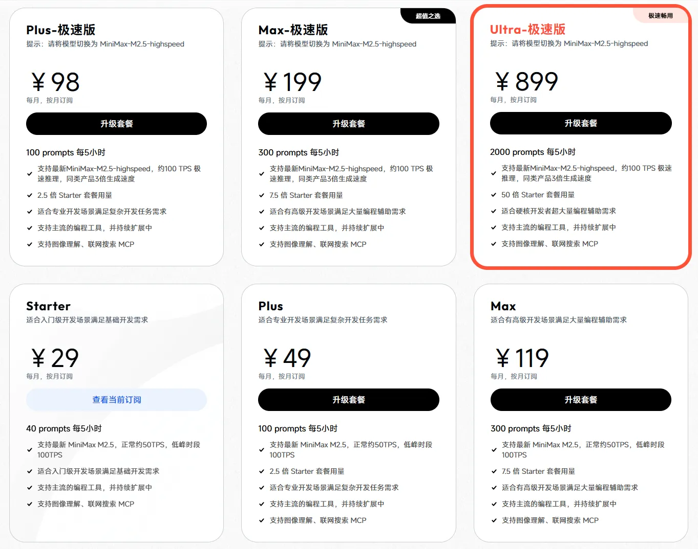

不到一顿火锅的钱，养一只 7×24 小时在线打工的 🦞

把我的配置经验整理了一下，希望能帮到想入坑的你 🚀

---

## 1. 云服务器

一开始，我在自己的 MacBook Air 上体验了 OpenClaw。但考虑到 7×24 小时运行的需求，最终还是决定租一台云服务器。

反复对比之后，我选择了 **火山引擎·香港**：
- 配置：2核4G
- 价格：约 ¥99/月

2G 内存虽然更便宜，但实测跑 agent-browser skill 时会爆内存，因此调大了一点内存。

**香港服务器的优势**：
- **默认自带翻墙，能直连 Github、Google、Clawhub**
- 但由于是机房 IP，OpenAI、Anthropic、Gemini API 会被墙
- 这个问题不大，可以通过 [WildCard](https://gptsapi.net/) 解决

我之前尝试过用国内服务器 + Clash 订阅代理，但在安装 OpenClaw 下载 git、node 时就遇到了 502 Bad Gateway，估计和云服务器的网络配置有些冲突。于是思来想去，为了省心就直接选香港服务器了——事实上效果确实让我省心很多。

**相关链接**：
- [火山引擎香港实例购买](https://console.volcengine.com/ecs/region:ecs+cn-hongkong/buy)

---

## 2. Minimax Coding Plan



推荐先用最低版 **¥29/月** 的套餐体验一下，后续按需提升。

**相关链接**：
- [订阅套餐](https://platform.minimaxi.com/subscribe/coding-plan)
- [Coding Plan API Key](https://platform.minimaxi.com/user-center/payment/coding-plan)

---

## 3. 原生安装 OpenClaw

这里不太推荐使用云服务器厂商的应用模板，配置起来不爽。

直接使用官方原生安装方式就好，香港服务器配上 200Mbps 带宽，安装起来很快。

```bash
# Linux/MacOS
curl -fsSL https://openclaw.ai/install.sh | bash
```

按步骤配置即可。**注意跳过 OpenClaw 内置的飞书配置！**

### 3.1 配置 Brave Search

Brave Search 是给 🦞 用的 Web Search 工具，每个月都有免费额度，足够体验使用。

**缺点**：开通订阅时需要绑定美国信用卡。**建议找闲鱼代绑**，30 元以内解决。

#### 获取 API 密钥
1. 在 [Brave Search API](https://brave.com/search/api/) 创建账户
2. 在控制面板中选择 "Data for Search" 套餐并生成 API 密钥
3. 将密钥配置到 OpenClaw 中

配置示例：
```json
{
  "tools": {
    "web": {
      "search": {
        "provider": "brave",
        "apiKey": "你的BRAVE_API_KEY",
        "maxResults": 5,
        "timeoutSeconds": 30
      }
    }
  }
}
```

**参考**：[Brave Search 文档](https://docs.openclaw.ai/zh-CN/brave-search)

---

## 4. 安装 OpenClaw 飞书官方插件

不要用 OpenClaw 内置的飞书 channel，用飞书官方插件，体验真的很赞。

在命令行终端中，执行以下安装指令。若执行命令行出错，可在命令行前增加 sudo 重新执行。

```SHELL
npx -y @larksuite/openclaw-lark-tools install
```

直接用 `/feishu auth` 一键完成授权，后续让 OpenClaw 使用飞书云文档、多维表格都畅通无阻。

**参考**：[飞书官方插件文档](https://bytedance.larkoffice.com/docx/MFK7dDFLFoVlOGxWCv5cTXKmnMh)

---

## 5. 设置 tools.profile 为 full 模式

因为我这是独立隔离的服务器，所以直接省心用 full 模式玩了。

编辑 `~/.openclaw/openclaw.json`，将 `tools.profile` 设置为 `full` 即可。

**参考**：[Tools 文档](https://docs.openclaw.ai/zh-CN/tools)

---

## 用飞书和 🦞 对话吧！

现在就可以开始养龙虾啦！

后续可以自己凭兴趣下载些 Skill 玩玩：[ClawHub](https://clawhub.ai/)

个人推荐：
- **aliyun-asr**：接入阿里云 ASR API 实现语音识别，然后就可以用语音和你的 🦞 对话了。能听懂你说的话（但还不能说话）。个人感觉阿里云 ASR 比 Whisper 好用——本地运行 Whisper 挺吃配置，效果也不如 API
- **weather-zh**：中文天气查询工具，使用中国天气网获取实时天气（无需 API 密钥，不依赖大模型），输出格式也非常不错，会提供各种生活指数，如紫外线、穿衣建议、运动指数、洗车指数等
- **agent-browser**：贼好玩，让 Agent 像打工人一样刷网页干活。之前用 2 核 2G 内存的时候，让它给我的 GitHub 项目点个赞，结果把内存炸了 🤭

---

## 写在最后

OpenClaw 确实是一个让人眼前一亮的项目。

也许它就是下一个时代的 Android 呢？

玩得开心 🎉

<div style="text-align: right">
<em>本文编辑：🦞 Andy</em>
</div>
