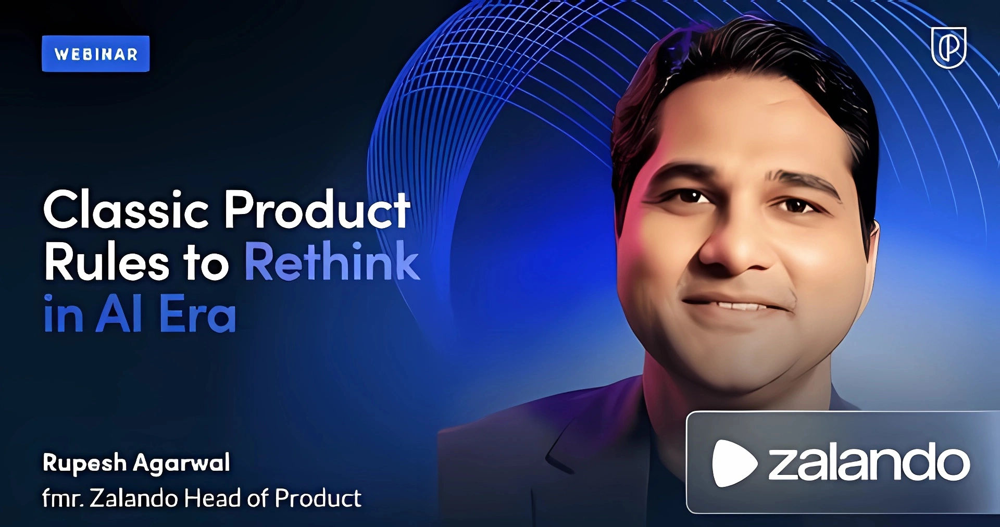
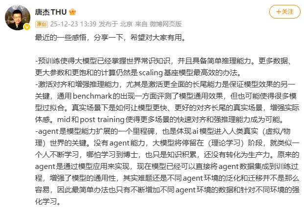
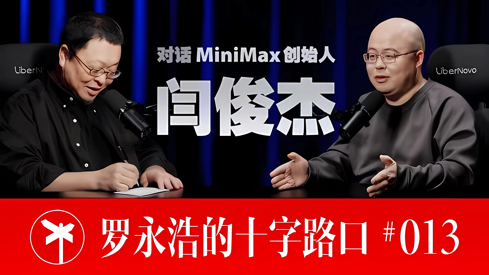
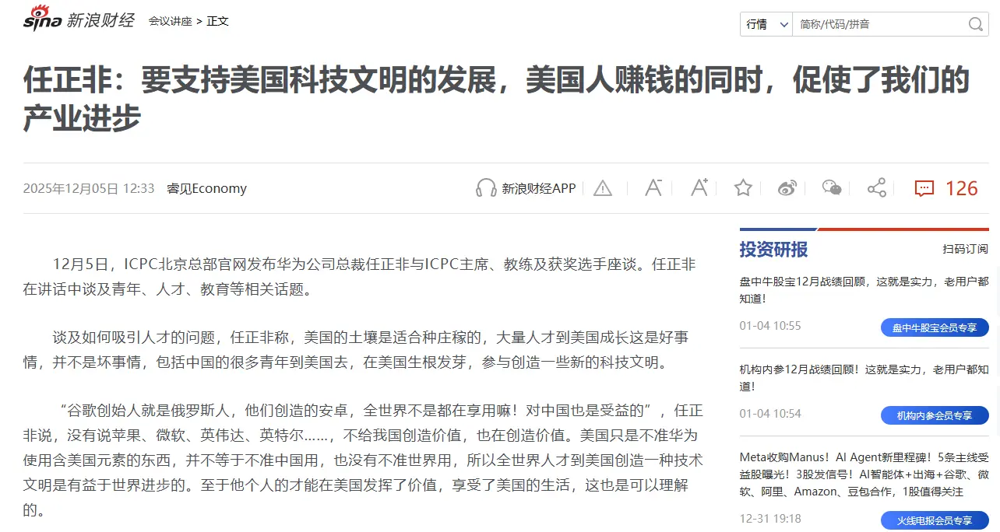

## #1 人工智能时代需要反思的经典产品规则

*Rupesh Agarwal｜前 Zalando 产品负责人*

**传统 PM 经验在 AI 场景下可能整体失效。**

前 Zalando 产品负责人 Rupesh Agarwal 在本视频中概述了产品负责人在向 AI 时代转型时需要做出的十个关键转变：

- **转变 1：从确定性到概率性**

在经典产品中，功能是确定性的。如果你发布一个登录按钮，它要么能用，要么不能用。相同的输入，结果相同。然而在 AI 产品中，输出变成了概率性的。相同的输入可能产生不同的结果，准确率也会波动。

因此，思维模式要从“控制”转变为“引导”。这意味着 AI 将产品工作从确定性管理转变为概率管理。对你而言，这意味着停止承诺确定性，开始管理概率范围。

- **转变 2：从发布功能到训练系统**

在传统产品管理中，焦点几乎总是像时钟一样精准地发布功能。然而在 AI 产品世界里，真正的产品是从数据中学习的系统。你真正的产品是持续训练和再训练的系统。

这对你意味着：你的路线图必须包含数据质量、再训练周期和模型监控，而不仅仅是 UI 或工作流的发布。

- **转变 3：从客户反馈到数据反馈**

在传统产品中，反馈通常来自访谈或调查。但对于 AI 产品，反馈往往来自错误标记或缺失的数据。

最重要的反馈可能永远不会直接来自用户。用户描述症状，数据揭示原因。这对你意味着：必须建立持续观察模型输入和输出的系统，反馈现在存在于你的数据之中。

- **转变 4：从静态 KPI 到动态性能**

在经典产品中，成功通常通过采用率、留存率、收入等来衡量。然而在 AI 产品中，我们需要额外的指标：模型准确性、延迟、公平性、偏见和可解释性。

这里的业务 KPI 失败通常追溯到模型性能问题，而不仅仅是产品 UI 缺陷。因此，平衡这些指标与传统 KPI 至关重要。如果一方出现漂移，另一方就会崩溃。这里的要点是：AI 产品的失败通常不在 UI 层，而在模型层。这对你意味着：你需要从两个维度衡量绩效——业务影响和模型行为。

- **转变 5：从拥有功能到跨学科协同**

在传统产品管理角色中，你通常作为一个“铁三角”进行协调：工程师、产品经理、设计师。但在构建 AI 产品时，领导者还需要与数据科学家、机器学习 (ML) 工程师以及法律和合规团队协调。

发布一个功能需要跨职能的编排，而不仅仅是产品铁三角。你的角色扩展了。你不再仅仅管理功能，你的领导力扩展到了系统、模型和治理。要点是：AI 产品经理不管理功能，他们指挥系统。这对你意味着：从操作员转变为指挥家。

- **转变 6：从可预测的时间线到迭代实验**

在经典产品中，我们可以以相对较高的置信度估算交付时间线。然而在构建 AI 产品时，引入了不确定性，因为模型性能只能通过实验和真实数据来验证。

这里的要点：对于 AI 产品，实验就是路线图。这对你意味着：你的路线图从交付功能转变为运行实验，以消除未知风险。

- **转变 7：从 UX 为王到信任即易用性**

在非 AI 产品中，用户体验驱动采用。然而，AI 产品将 UX 与模型性能结合在一起，如果预测出错，即使界面再好也会失败。

性能和体验必须共同进化，因此领导者必须平衡设计的稳健性和 AI 输出的可信度。要点是：在 AI 中，信任是新的易用性。这对你意味着：设计和模型性能必须共同负责，你要优化的不仅仅是易用性，还有信任。

- **转变 8：从竞品对标到模型竞赛**

在传统产品的竞品对标中，焦点主要集中在功能或 UX 上。你的客户会要求拥有他们在竞争对手产品中看到的有趣功能或类似体验。然而在 AI 产品中，这是一个快速移动的领域。一个新的模型或数据集可以让你的解决方案很快过时。

你的竞争对手可能不会用功能打败你，他们会用更好的模型打败你。要点是：功能老化得很慢，而模型一夜之间就会过时。这对你意味着：竞争对手的模型可能是威胁，而不仅仅是他们的 UI/UX。关键在于数据模型，最重要的是迭代速度。

- **转变 9：从隐私即合规到隐私即差异化**

在传统产品中，你将隐私视为监管的复选框，通常试图找到绕过它的方法或只是做得“足够好”。然而在 AI 产品中，你依赖数据。因此，隐私、安全和偏见缓解对于信任至关重要。领导者必须将负责任的 AI (Responsible AI) 视为核心产品功能，而不仅仅是护栏。

因此，在构建 AI 产品时，负责任和隐私是不可协商的，很多时候它是关键的差异化因素。要点是：负责任的 AI 现在是一种产品能力，信任必须成为你核心价值的一部分。

- **转变 10：从直觉到数据与直觉混合**
  
在传统产品中，优秀的产品经理严重依赖直觉，最重要的是深度的用户同理心。然而在 AI 产品中，你可能会产生人类无法感知的洞察。AI 产品决策通常是反直觉的。模型可能会揭示人类猜不到的模式。因此，领导者必须将人类判断与数据驱动的证据结合起来做决策。

你必须围绕产品思考“人在回路 (Human-in-the-loop)”的流程，将直觉和推理结合起来。要点是：未来属于那些既信任本能又信任推理的领导者。这对你意味着：新时代产品经理的超能力是将直觉与模型洞察相融合。

> 原文链接：[https://www.bestblogs.dev/video/5c20e7b](https://www.bestblogs.dev/video/5c20e7b)

## #2 唐杰：谈 2025 年对大模型的看法

*清华大学教授，智谱 AI 首席科学家*

结合我目前的实际工作，对其中几个**对我价值极高的判断**做了整理与提炼：

- 真实场景下，如何让模型更快、更好的对齐长尾的真实场景，增强实际体感。mid和post training使得更多场景的快速对齐和强推理能力成为可能。

- ai模型应用的第一性原理不应该是创造新的app，他的本质是agi替代人类工作，因此研发替代不同工种的ai是应用的关键。明年将是ai替代不同工种的爆发年。

- ai模型应用可能就是两种，一种就是ai化以前的软件，原来需要人参与的改成ai；另一种就是创造对齐人类某个工种的ai软件，替代人类工作。

- 我一直认为领域大模型就是个伪命题，都agi了哪有什么domain-specific agi……简而言之，领域的数据、流程、agent数据慢慢的都会进入主模型。

> 原文链接：[https://weibo.com/2126427211/5247011059141988](https://weibo.com/2126427211/5247011059141988)

## #3 MiniMax 创始人闫俊杰 × 罗永浩

开头前半小时里，有两段话让我很受启发：

1. 随着 AI 能力不断增强，产品经理也可以参与原型开发，开发者也可以提出更多创意想法。**不论是产品经理、开发还是算法工程师，彼此之间的边界都会逐渐变得模糊**。区别只在于不同阶段由不同角色主导：在底层算法阶段，由算法主导，但产品和开发也可以参与；在头脑风暴阶段，由产品经理主导；而在真正进入工程落地时，则由开发主导，但大家也都可以参与进来。只是在不同的阶段，大家的角色会发生变化。我认为这是一种更和谐、上限也更高的协作方式。

2. **我们不应该将 AI 行业简单视为互联网行业的延续**，因此也不用太在意，比如说在移动互联网时代，大家是怎么来分工的。

> 原文链接：[https://www.bilibili.com/video/BV11NmtBzE36](https://www.bilibili.com/video/BV11NmtBzE36)

## #4 任正非：要支持美国科技文明的发展

美国以硅谷为代表的软件创新依然处于全球领先地位，而中国以深圳为代表的硬件创新同样令全球瞩目。**从长期看，全球化合作确实是理性意义上的最优解**。

> 原文链接：[https://finance.sina.com.cn/hy/hyjz/2025-12-05/doc-infztptz9571666.shtml](https://finance.sina.com.cn/hy/hyjz/2025-12-05/doc-infztptz9571666.shtml)
