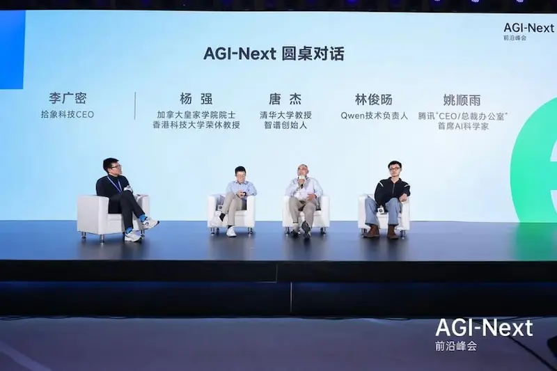
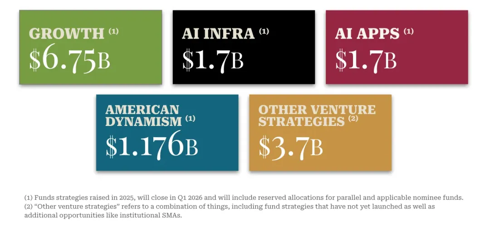
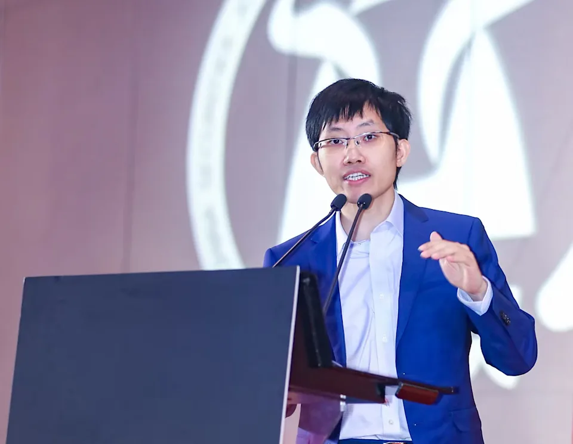

## #1 圆桌对话：关于中国 AI 的未来 {#china-ai-future}

本月 10 日，在北京中关村举办的「AGI-Next 前沿峰会」上，中国多位顶尖的大模型领导者齐聚一堂。

其中一段围绕「中国 AI 的未来」展开的圆桌讨论，整体质量非常高，让我印象深刻。

> **姚顺雨**：OpenAI 前核心研究者、腾讯 AI 新部门负责人  
> **林俊旸**：阿里 Qwen 技术负责人  
> **唐杰**：清华大学教授，智谱创始人  

我特别赞同姚顺雨关于**中国需要一个更成熟的 ToB 市场**的判断。市场，终究是技术与产品孵化最重要的“底池”。  
他还进一步提到一个主观因素——**中国具备创新与冒险精神的人不够多**。在我看来，某种程度上，也正是因为缺乏成熟的市场支持，导致创新的回报风险大、投入不确定性高，而社会兜底机制与对失败的包容性尚不完善，这些因素叠加在一起，才使得国内真正敢于放手一搏的人并不多。

中美之间在财富规模与算力储备上的差距本身并不令人意外，但林俊旸提到，**中国在算力层面可能落后美国 1–2 个数量级**，这一点仍然让我感到震惊。在 scaling law 的作用下，这样的差距并非线性，而是会对模型能力产生显著影响。  
此外，他对 **「未来最领先的 AI 公司是一家中国公司的概率大约 20% 」** 的判断，也让我感觉非常务实，尤其是他提到，这里面“**真的有很多历史积淀的原因**”，让我不得不苟同。

相比之下，唐杰的回答则更加稳健。  
他在正视现实差距的同时，也明确提到，**中国的国家战略与营商环境正在逐步改善，对创新的鼓励力度也在持续增强**；  
与此同时，**中国的年轻一代正在变得更愿意承担风险，去尝试不确定性更高的事情**。  
顺着这条逻辑推演，**未来的走向，终究仍然取决于我们每一个人自己**。这是一个非常朴素，却充满智慧的判断。

以下内容摘录自：[科技爱好者周刊（第 381 期）：中国 AI 大模型领导者在想什么](https://www.ruanyifeng.com/blog/2026/01/weekly-issue-381.html)

发言实录：[https://www.53ai.com/news/LargeLanguageModel/2026011069524.html](https://www.53ai.com/news/LargeLanguageModel/2026011069524.html)

### 主持人提问

李广密（主持人）：我想问大家一个问题，在三年和五年以后，全球最领先的 AI 公司是中国团队的概率有多大？我们从今天的跟随者变成未来的引领者，这个过程到底还有哪些需要去做好？

### 姚顺雨的回答

我觉得概率还挺高的，我挺乐观的。目前看起来，任何一个事情一旦被发现，在中国就能够很快的复现，在很多局部做得更好，包括之前制造业、电动车这样的例子已经不断地发生。

我觉得可能有几个比较关键的点。

（1）中国的光刻机到底能不能突破，如果最终算力变成了瓶颈，我们能不能解决算力问题。

（2）能不能有更成熟的 To B 市场。今天我们看到很多做生产力或者做 To B 的模型和应用，还是会诞生在美国，因为支付意愿更强，文化更好。今天在国内做这个事情很难，所以大家都会选择出海或者国际化。这和算力是比较大的客观因素。

（3）更重要的是主观因素，我觉得中国想要突破新的范式或者做非常冒险事情的人可能还不够多。也就是说，有没有更多有创业精神或者冒险精神的人，真的想要去做前沿探索或者范式突破的事情。我们到底能不能引领新的范式，这可能是今天中国唯一要解决的问题，因为其他所有做的事情，无论是商业，还是产业设计，还是做工程，我们某种程度上已经比美国做得更好。

### 林俊旸的回答

这个问题是个危险的问题，理论上这个场合是不可以泼冷水的，但如果从概率上来说，我可能想说一下我感受到的中国和美国的差异。比如说，美国的 Compute（算力）可能整体比我们大1-2个数量级，但我看到不管是 OpenAI 还是什么，他们大量的算力投入到的是下一代研究当中去，我们今天相对来说捉襟见肘，光交付可能就已经占据了我们绝大部分的算力，这会是一个比较大的差异。

这可能是历史上就有的问题，创新是发生在有钱的人手里，还是穷人手里。穷人不是没机会，我们觉得这些富哥真的很浪费，他们训练了这么多东西，可能训练了很多也没什么用。但今天穷的话，比如今天所谓的算法 Infra（基础设施）联合优化的事情，如果你真的很富，就没有什么动力去做这个事情。

未来可能还有一个点，如果从软硬结合的角度，我们下一代的模型和芯片的软硬结合，是不是真的有可能做出来？

2021年，我在做大模型，阿里做芯片的同学，找我说能不能预测一下，三年之后这个模型是不是 Transformer，是不是多模态。为什么是三年呢？他说我们需要三年时间才能流片。我当时的回答是三年之后在不在阿里巴巴，我都不知道！但我今天还在阿里巴巴，它果然还是 Transformer，果然还是多模态，我非常懊悔为什么当时没有催他去做。当时我们的交流非常鸡同鸭讲，他给我讲了一大堆东西，我完全听不懂，我给他讲，他也不知道我们在做什么，就错过了这个机会。这个机会有没有可能再来一次？我们虽然是一群穷人，是不是穷则思变，创新的机会会不会发生在这里？

今天我们教育在变好，我属于90年代靠前一些的，顺雨属于90年代靠后一点的，我们团队里面有很多00后，我感觉大家的冒险精神变得越来越强。美国人天然有非常强烈的冒险精神，一个很典型的例子是当时电动车刚出来，甚至开车会意外身亡的情况下，依然会有很多富豪们都愿意去做这个事情，但在中国，我相信富豪们是不会去干这个事情的，大家会做一些很安全的事情。今天大家的冒险精神开始变得更好，中国的营商环境也在变得更好的情况下，我觉得是有可能带来一些创新的。概率没那么大，但真的有可能。

三年到五年后，最领先的 AI 公司是一家中国公司的概率，我觉得是20%吧，20%已经非常乐观了，因为真的有很多历史积淀的原因在这里。

### 唐杰的回答

首先我觉得确实要承认，无论是做研究，尤其是企业界的 AI Lab，和美国是有差距的，这是第一点。

我们做了一些开源，可能有些人觉得很兴奋，觉得中国的大模型好像已经超过美国了。其实可能真正的情况是我们的差距也许还在拉大，因为美国那边的大模型更多的还在闭源，我们是在开源上面玩了让自己感到高兴的，我们的差距并没有像我们想象的那样好像在缩小。有些地方我们可能做的还不错，我们还要承认自己面临的一些挑战和差距。

但我觉得，现在慢慢变得越来越好。

（1）90后、00后这一代，远远好过之前。一群聪明人真的敢做特别冒险的事，我觉得现在是有的，00后这一代，包括90后这一代是有的，包括俊旸、Kimi、顺雨都非常愿意冒风险来做这样的事情。

（2）咱们的环境可能更好一些，无论是国家的环境，比如说大企业和小企业之间的竞争，创业企业之间的问题，包括我们的营商环境。

（3）回到我们每个人自己身上，就是我们能不能坚持。我们能不能愿意在一条路上敢做、敢冒险，而且环境还不错。如果我们笨笨的坚持，也许走到最后的就是我们。

## #2 再募 150 亿美元，拿走全美 18% 的风投资金，a16z 是怎么运转的 {#a16z}

我一直对美国雄厚的风险投资资本心生羡慕——它似乎为广大的科技创业者们，提供了广阔的试错空间与极长的时间窗口。

但换一个视角来看，风险投资基金本身，同样也是高净值人群进行资产配置、获取超额收益的一种金融工具。

理解 a16z 的运作方式，或许能够让人从资本这一侧，管中窥豹，略探一二。

原文链接：[再募 150 亿美元，拿走全美 18%的风投资金，3 万字长文聊聊 a16z 是怎么运转的？](https://mp.weixin.qq.com/s?__biz=Mzg5NTc0MjgwMw==&mid=2247522244&idx=1&sn=b34331e96dd4666405481100092a05f1&poc_token=HFvZaWmju_Tu9t44hFxxiNaw90M9Rw7ww1BSSqYL)

## #3 没有商业模式--DeepSeek最坚固的“护城河”

> 需要明确的是，梁文锋在 2023 年 ChatGPT 推出几个月后想要创办 DeepSeek 时，确实曾尝试从中国投资者那里筹集风险投资。**但他那“笃信AGI（AGI-pilled）”的理想主义，加上缺乏商业计划书，以及中国VC著名的短视和风险厌恶，导致了那次融资努力的失败——但这反而塞翁失马，焉知非福**

结合我自身在多家创业公司，以及上市公司的 AI 创新团队中的工作经验，我对 DeepSeek 背后的技术理想主义抱有高度敬意，同时也对文中提到的关于“中国 VC 的短视和风险厌恶”这一判断深有同感。

也许，从纯粹的商业思维看，投入真金白银去做一件**回报周期长、投入产出比不确定，甚至可能长期亏损**的技术探索型事业，几乎注定是一门“不划算”的亏本生意。

但这个世界是多元的，至少有一部分事实证明——**许多在早期长期亏损的技术理想型事业，反而在最终取得了令人惊叹的成就。**

DeepSeek 如此，  
Tesla、SpaceX、Amazon 等亦是如此。

商业不只等同于盈利。  
也许在不远的将来，中国也能够逐步建立起**更具容亏性的金融与创新支持机制**，去承受那些早期高风险、小团队、草根型的科创项目，去鼓励更多创业者在中国进行科技创业。

我由衷地期待那一天的到来。

> 去年，幻方以 53% 的回报率赚了超 7 亿美元（约 50 亿人民币）的利润。  
> **梁文锋直接把这些钱拿来买显卡、招人**，  
> 这种用“老钱”养“新梦”的模式，让他完全不需要看投资人的脸色。

原文链接：[没有商业模式--DeepSeek最坚固的“护城河”](https://wallstreetcn.com/articles/3763534)