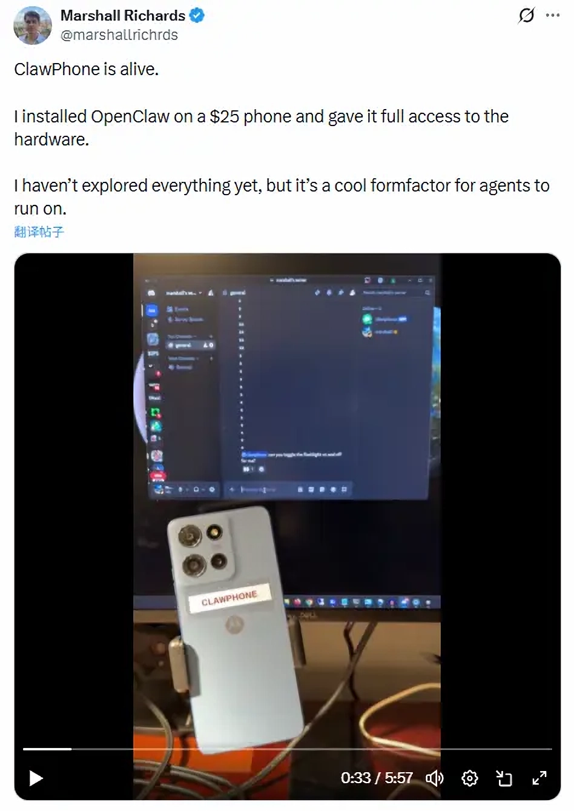
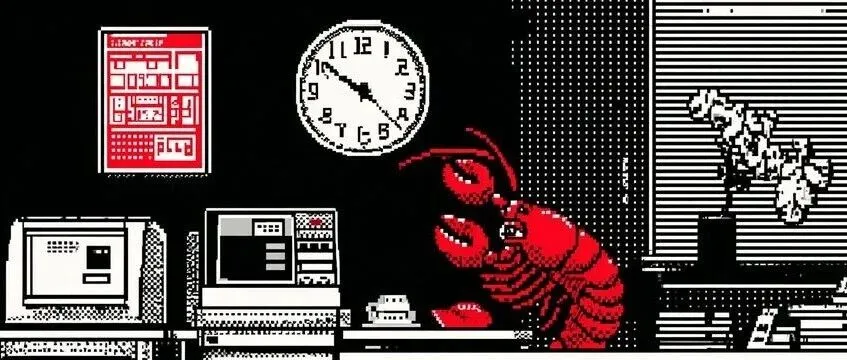

## #1 OpenClaw 开发者: 未来 80% 的 App 将会消失

> 我们每天在几十个 App 之间切换：在微信回消息，在日历看日程，在打车软件叫车。这种割裂的体验是移动互联网时代的遗毒。
> 
> OpenClaw（前称 Clawdbot）开发者 Peter 做出了一个大胆的预测：**未来 80% 的 App 将会消失，或者退化为纯粹的 API 接口**。
> 
> ——[OpenClaw 开发者：为什么 80% 的应用会消失？丨 Y Combinator
](https://mp.weixin.qq.com/s?__biz=Mzk5MDkxNDU4Nw==&mid=2247485463&idx=1&sn=5cdb17628076422599ee3005e375b545&poc_token=HEeHiWmjVKA-kX3_Hv3TlHJzZd0D_AJO-XVVClUZ)

这真是个掷地有声的观点。

起初我以为，这又是某个吹捧 “AI 将会重塑一切” 的陈词滥调，但当看到后半句 “(APP)将退化为纯粹的 API 接口”时，判断便发生了转折——这实在是只有真正具备丰富的 AI 落地经验的人才会有的洞察。

当 AI 不再只是一个能写文档、能聊天的文字助手，而是切实具备**自我思考**与**执行能力**的智能体，并可以通过协议与各类 APP 联系在一起，那么它将产生的效能，将远不止于 OpenClaw 目前所展示出的个人助手效果。

### CLI vs MCP：回归最原始、最强大的交互方式

> 在交互设计上，Peter 提出一个观点：图形界面（GUI）是给人类用的，但对于 AI Agent 来说，命令行界面（CLI）才是最高效的。现在的很多 AI 工具试图模仿人类去点击屏幕，这其实是一种低效的拟人化。
> 
> OpenClaw 的设计哲学是复古的，它大量使用类似终端的指令交互。这虽然提高了上手门槛，但极大地提升了操作上限。你可以用一行命令完成复杂的任务链，比如“查找过去一周所有关于‘发票’的邮件，提取附件，分类保存，并生成汇总表”。
> 
> *“不要试图让机器人像人一样去点鼠标。那是对算力的浪费。给它们最原始的接口，它们能跑得飞快。”*
> 
> 这不仅仅是复古，更是对人机交互效率的极致追求。

计算机本身并不需要 GUI。

图形化用户界面（GUI）的诞生，毫无疑问是计算机发展史上的重要里程碑。它源于贝尔实验室，1973 年推出的 Alto 电脑首次将图形界面系统完整地整合到计算机中。史蒂夫·乔布斯在参观了 Alto 后深受启发，随后苹果公司推出的“Apple II”上也有 Alto 的身影，并且在后续的所有个人计算机产品中，也都能看到这一理念的延续。

GUI 极大地降低了计算机的使用门槛，让原本需要依赖语法输入的 CLI 交互，转变为只需用鼠标点击图标即可完成的轻松操作。但真正需要 GUI 的，是人类，AI 本身未必如此。

从底层逻辑来说，GUI 的交互最终只是被拆解为前后端之间的指令调用，本质上不过是用户终端与服务器之间的一系列指令传递。那么，当我们希望让 AI 替代人类，去自动完成这些复杂交互，以此来替人执行工作的时候，我们需要让 AI 真正操作的，只是那些最底层的指令，而不是一个个带有 UI 的 APP。

那么，如何将这些底层指令暴露给 AI 使用呢？答案便是 API。

因此，**未来 80% 的 App 将会消失，或者退化为纯粹的 API 接口**，并非虚言，实在是掷地有声的判断！

### 关于豆包手机

谈到通过 GUI 来实现 AI 自动化工作的工具，就不可避免地会让人想到字节跳动于去年 12 月推出的豆包手机。

难道是字节跳动愚蠢吗？当然不是。

作为一家全球顶尖的互联网公司，**他们既是 AI 时代的开拓者，也是最不希望 APP 消失的守成者。**

AI 通过 GUI 实现自动化工作，从底层原理看似乎并不优雅，但它最大的优势恰恰在于——**一切有着 GUI 的 APP 都是现成的**。

这意味着，只要打通 AI 操作 GUI 的这一个技术环节，剩下的工具调用体系几乎全部现成可用。在当下阶段，这反而是**成本最优的现实路径**，同时也能够稳固互联网大厂既有的核心 APP 业务，实在是一举两得。

如果说 OpenClaw 代表的是开源社区中最自由、最先锋的技术理想主义，那么，豆包手机所象征的，则是更加成熟与务实的 AI 现实路径。

### 技术最终是为人服务的

人类真正关心的，从来不是工具的形态——是电脑、手机，还是 AI Agent；是依赖图形界面的 APP，还是仅通过 API 运转的智能系统。

人们在意的，是它**是否能够提升生活质量，是否能够提高工作效率**。

技术形态或许不断更迭，但技术背后的目标始终未变：**为人服务**。

而这份温度，远比形式本身更重要。

## #2 ClawPhone 闪亮登场

> 开发者 Marshall Richards 将这一 AI 代理安装到一款约 25 美元的二手安卓手机上，并通过 root 权限赋予其对硬件的完整访问权。
> 
> **这使得 ClawPhone 能够访问摄像头、麦克风、传感器等硬件，还能操作文件系统、执行 shell 命令，并具备连接 IoT 设备或硬件（如机器人或家居自动化系统）的潜力，实现低成本的 AI 物理载体探索。**
>
> ——[超越豆包手机！“ClawPhone”炸裂登场， OpenClaw 将二手安卓机变为 AI 神器](https://mp.weixin.qq.com/s/oW4XYQtlt4Pa981kiXQwlw)

当 AI Agent 直接下沉到最底层的系统权限与硬件接口上时，那么它所面对的，将不再是 GUI，而是**操作系统**本身。

技术的发展，真是让人目不暇接。

## #3 对 OpenClaw 和下一代 AI 产品的 39 条思考

> 原文链接：[https://mp.weixin.qq.com/s?__biz=Mzg5NTc0MjgwMw==&...](https://mp.weixin.qq.com/s?__biz=Mzg5NTc0MjgwMw==&mid=2247522622&idx=1&sn=915a298b9821ae8d3205f9044a6a6060&poc_token=HOyeimmjgpHJ98LyXtR7ETUdtBE4pw3kOAU-_IOc)

这其中有几条让我看着挺有感触的：

### 1. Skills 就是新时代的 Apps

假设未来 OpenClaw 真的能像它的开发者所描述的那样，让 80% 的 APP 退化为 API，那么承载这些能力的 Skills，毋庸置疑将成为新时代的 Apps。

原来充满各种 UI 界面的 APP Store，也将会演变为系统层级的 Skill Store，而 OpenClaw，则可能成为新时代的 Android。

> **未来绝大多数产品都会「Skill 化」，所有的 Apps 也会「Skill 化」**。开发者不再需要维护 UI 界面，只需要提供能力，做好被发现、被调用的机制，以及与 Agent 和人的交互体验就可以了。

### 2. 未来的 AI 产品，应该「活」在用户最高频的工作流中

>  以前用 AI，先想到 ChatGPT、豆包这类「目的地」应用，主动去打开它。**虽然 ChatGPT 周活能做到 10 亿，但始终是个有限的入口**。
> 
> 但现在，**OpenClaw 能在所有的 IM 和任何能做聊天的入口做交互。这意味着，AI 的入口，从单个 App 一下子到了能覆盖百亿甚至千亿用户**。这是第一次，用户在真正意义上能以最自然、最直接的方式和 Agent 交互。

这是一个很重要的范式转变——  
过去，是 AI 产品创造一个新的入口，吸引用户主动前往；  
而未来，也许是 AI 主动「活」进用户最高频的工作流中，用户只需发一条消息便能使用。

具体的示例如下：

#### IM 即入口

OpenClaw 已经实现对 WhatsApp、Telegram、Slack、Discord 等海外常用 IM 工具的适配；国内如飞书、钉钉、企业微信等，也有开发者在积极适配中。这本身就已经足够让人感受到便利与范式迁移。但真正有想象力的，还不止于此。

#### 社交场景即入口

这让我联想到[「元宝派」](https://baike.baidu.com/item/%E5%85%83%E5%AE%9D%E6%B4%BE/67287386)。

如果想象力再大胆一些——**元宝派是否有可能成为腾讯在 AI 时代的新一代全民社交产品？**

正如它曾在 PC 时代打造 QQ，在移动互联网时代打造微信那样。

别忘了，马化腾曾亲口表示：[**希望重现微信红包的时刻**](https://baijiahao.baidu.com/s?id=1855368259045436301&wfr=baike)。而微信红包，恰恰就是微信迈向全民化的一个重要里程碑。

#### 交易场景即入口

这一点更多是对金融场景的想象，具体领域我并不了解，但想象一下：在所有的金融交易工作流中，都能在最触手可得的地方，直接调用 AI 的能力，这种想象本身就足够震撼。

别忘了，DeepSeek 的母公司幻方科技本身就是做私募的。设想 DeepSeek 全面接入量化交易工作流——光是想象，就已经足够令人兴奋。

### 3. 大量的 AI 应用仍未真正触达大众市场

这是这篇文章里最让我触动的一句话。

当下看似 AI 浪潮汹涌澎湃，但更多仍停留在美国硅谷科技圈，以及国内少量科创公司与大厂的赛道。真正如同互联网与移动互联网时代那样——**成千上万家公司涌入，开发软件与 APP 的时代，或许还未真正到来**。

大量 AI 应用仍未触达更广泛、更下沉、更多元的大众市场，商业模式仍然有待验证。

AI 的未来，依然让人充满无限想象。